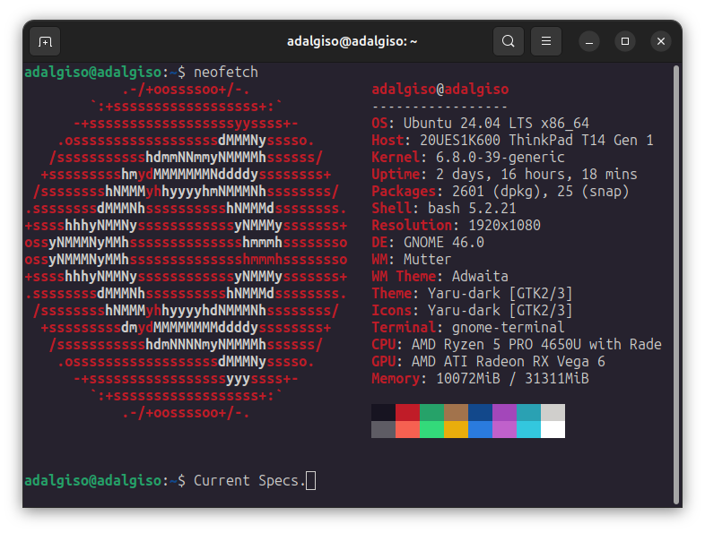

# mlopsency: you interest to mlops? here's your encyclopedic repo 👊

> Update or CHANGELOG are recorded here: [MLOps Notebooks: Daily Learning](https://pandohansamuel19.notion.site/ea321f9d82154f04919cff9cbd38ddc5?v=15354b42e3144ef5bad1e71336afad46&pvs=4)

All the implementations are running with this current specs and Google Colab Pro.

## Focus of Learn
> Approximately 2 hours/day to learn or update some implementations. On my calender is set from 5.00 - 7.00 (maybe i will provide some sheets later), but if i still in morning person.

The Hopes that can be implement for this repo:
- What is `'Machine Learning'` or `'Artificial Intelligence'`
- Operations for Implementations
- Imitating [training-data-analyst](https://github.com/GoogleCloudPlatform/training-data-analyst), but be more encyclopedic ways.
- Well, just my preferable ways to learn for the swe + ml/ops + devops in programmic way. So not just only the theoritical thigs but can provide and serve it for users.
- can be maintainble as Open Source, specifically for Indonesian Developers
- Critical Thinking > Traditional Thinking
- Frameworks?? we will see ;)

## The Progressive Dirs
1. `bindings`: Well, we can learn why distinguished nn framework needs to be implemented for the other OOP paradigms programming languages
2. `docs`: Some interesting parts of resources will be surf on internet
3. `examples`: Not just learn the basics, but completely true that must used to real use-case examples. Here updated subdirs for now:
    - `autoencoder`
    - `convolutional`
    - `computer vision`
    - `ensemble`
    - `generative`
    - `graph`
    - `natural language processing`
    - `pretrained`
    - `reccurent`
    - `multimodal`
    - `tensorflow`
    - `pytorch`
4. `implementations`: Programmatic ways to served and used the ml/ai resources on types of applications. Here updated subdirs for now:
    - `android`
    - `backend`
    - `desktop`
    - `games`
    - `ios`
    - `raspberry pi`
5. `interdisciplinary`: Some sectors needs to implementing Machine Learning for their business. Here updated subdirs for now:
    - `bioinformatics`
    - `finance`
    - `geospatial`
    - `healthcare`
    - `quantum`
    - `security`
    - `system`
    - `xai`
6. `operations`: swe + devops ways for shipping the ml/ai applications/solutions. Here some subdirs for now:
    - `anomaly`
    - `automations`
    - `benchmarking`
    - `deployments`
    - `distributions`
    - `engineering`
    - `managements`
    - `monitoring`
    - `optimizations`
    - `orchestrations`
    - `pipelines`
    - `robustness`
    - `serializations`
    - `streaming`
    - `synthesis`
    - `versioning`
7. `papers`: sometimes we can learned from papers that can be interesting
8. `paradigms`: The core of ml/ai. if you don't understand paradigms, maybe kind of like 'zombie' or 'stupid'. Here some subdirs for now:
    - `analytics`
    - `automl`
    - `ensemble`
    - `federated`
    - `maths`
    - `mining`
    - `nn`
    - `reinforcement`
    - `supervised`
    - `transductive`
    - `unsupervised`
9. `tests`: since we want implementing swe + devops structurals, we need Test-Driven Development implementations for some sources so it'll clean and maintainable
10. `utilizers`: some clean code that repeatable used on other dirs.

## Contributions
For now, this repo only dedicated for myself. So, hopefully we can work together in more futures.